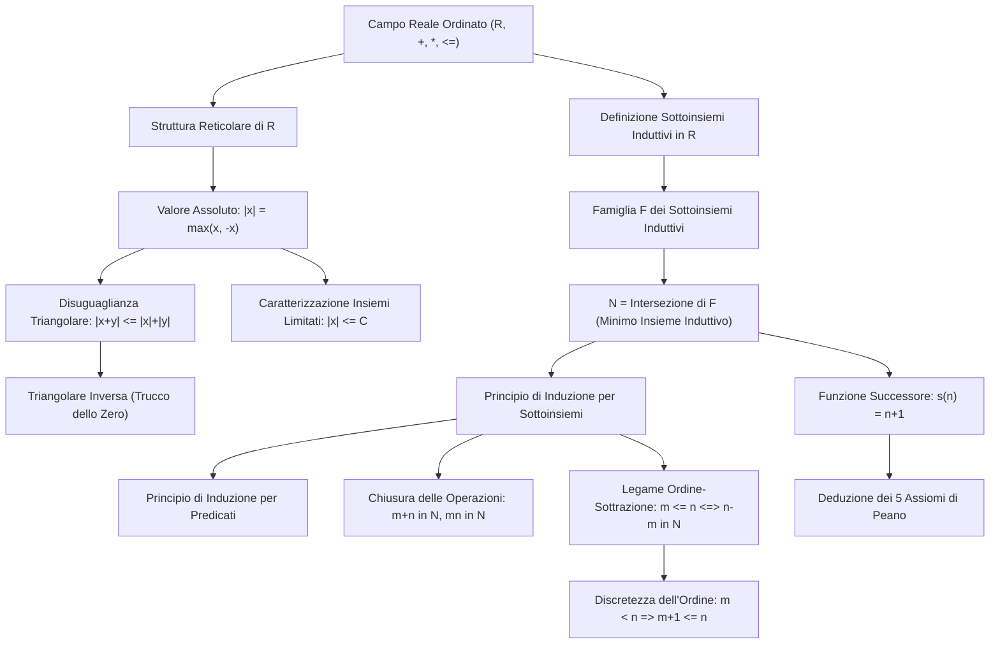

[[Home MOC|Home]] / [[University|University MOC]] / [[Fondamenti di Matematica (Analisi 1) MOC]] / [[06 - Valore Assoluto, Numeri Naturali e Principio di Induzione]]

# 06 - Valore Assoluto, Numeri Naturali e Principio di Induzione

- **Docenti:** Prof. Saverio Salzo / Canale A-L, Dott. Giovanni Franzina
- **Data Lezione:** 2026-10-01
- **Materiali Didattici Ufficiali:** \[[[Lezione 6 FdM.pdf#page=1|Dispensa Lezione 06 — Valore assoluto, numeri naturali (Franzina & Salzo)]]]
- **Testi di Riferimento Didattico:** \[[[Epsilon 1.pdf|Acerbi, Buttazzo — Epsilon 1 (Cap. 1)]]], \[[[Real Analysis.pdf|Carothers — Real Analysis (Cap. 1)]]]
- **Riferimento MOC:** [[Fondamenti di Matematica (Analisi 1) MOC]], [[Ingegneria Informatica 2026 - 27 MOC]]
- **Lezione Precedente:** [[05 - Numeri Reali, Campo Ordinato, Estremo Superiore e Assioma di Completezza]]
- **Collegamento Interdisciplinare:** [[01 - Teoria degli Insiemi, Spazio Campionario e Prime Nozioni di Probabilità]] e [[02 - Insieme delle Parti, Assiomi della Probabilità e Spazi Finiti]] (in cui la natura discreta dei numeri naturali $\mathbb{N}$ e l'induzione matematica costituiscono l'ossatura logica per definire le sequenze di prove indipendenti, la formula di inclusione-esclusione e le variabili aleatorie discrete con supporto numerabile)

La sesta lezione di Fondamenti di Matematica completa l'architettura dei sistemi numerici dell'Analisi Matematica. Dopo aver introdotto in [[05 - Numeri Reali, Campo Ordinato, Estremo Superiore e Assioma di Completezza]] il sistema continuo dei numeri reali $\mathbb{R}$ mediante gli assiomi di campo commutativo, l'ordinamento totale e l'assioma di completezza (esistenza dell'estremo superiore), l'attenzione si sposta su due pilastri operativi e fondativi:
1. Lo studio della struttura d'ordine reticolare di $\mathbb{R}$, formalizzata mediante il <mark style="background:rgba(255, 193, 69, 0.32)"><b>valore assoluto</b></mark>, le parti positiva e negativa, e le disuguaglianze triangolari (diretta e inversa), che definiscono la metrica euclidea standard;
2. La genesi rigorosa dell'insieme dei <mark style="background:rgba(255, 193, 69, 0.32)"><b>numeri naturali</b></mark> $\mathbb{N}$ come **minimo sottoinsieme induttivo** di $\mathbb{R}$, dal quale scaturiscono per via puramente deduttiva il <mark style="background:rgba(255, 193, 69, 0.32)"><b>principio di induzione matematica</b></mark>, gli storici assiomi di Peano, la chiusura algebrica e la proprietà di discretezza dell'ordine.

---

## 1. Struttura Reticolare di R e Valore Assoluto

La relazione d'ordine totale $(\mathbb{R}, \le)$ conferisce all'insieme dei numeri reali la proprietà algebrica di <mark style="background:rgba(181, 113, 255, 0.36)"><b>reticolo</b></mark> \[[[Lezione 6 FdM.pdf#page=1|Dispensa p. 1]]]. In un reticolo, ogni sottoinsieme finito — e in particolare ogni coppia di elementi $x, y \in \mathbb{R}$ — ammette sempre estremo superiore ed estremo inferiore. Essendo l'ordinamento totale, tali estremi coincidono rispettivamente con il massimo e con il minimo della coppia:
$$\sup\{x, y\} = \max\{x, y\}, \qquad \inf\{x, y\} = \min\{x, y\}$$

Sfruttando questa struttura reticolare, è possibile definire in modo univoco le componenti dimensionali di un numero reale rispetto all'origine $0$.

> [!info] Definizione 1.1: Valore Assoluto, Parte Positiva e Parte Negativa
> Per ogni $x \in \mathbb{R}$, si definiscono:
> $$|x| = \max\{x, -x\}$$
> $$x^+ = \max\{x, 0\}$$
> $$x^- = \max\{-x, 0\} = -\min\{x, 0\}$$
> - **Ipotesi:** $x \in \mathbb{R}$ elemento di un campo totalmente ordinato.
> - **Condizioni di validità:** Operazioni ben definite per ogni elemento reale grazie all'esistenza del massimo tra coppie di elementi.
> - **Significato dei simboli:**
>   - $|x|$: valore assoluto (o modulo) di $x$, esprime la distanza geometrica di $x$ dall'origine sulla retta reale.
>   - $x^+$: parte positiva di $x$, conserva il valore se $x \ge 0$ e si annulla altrimenti.
>   - $x^-$: parte negativa di $x$, misura l'ampiezza del difetto rispetto a zero (quantità non negativa).
> - **Esempio operativo:** Per $x = 3$, si ha $|3| = 3$, $3^+ = 3$, $3^- = 0$. Per $x = -5$, si ha $|-5| = 5$, $(-5)^+ = 0$, $(-5)^- = 5$.

> [!tip]- Flashcard: Definizione di Valore Assoluto e Parti Positiva/Negativa
%%
TARGET DECK: University::Fondamenti di Matematica (Analisi 1)::06 - Valore Assoluto, Numeri Naturali e Principio di Induzione
START
Basic
Front: Come sono definiti in un campo totalmente ordinato il valore assoluto $|x|$, la parte positiva $x^+$ e la parte negativa $x^-$ di un numero reale $x$?
Back: Sfruttando la struttura reticolare di $\mathbb{R}$:
1. Valore assoluto: $|x| = \max\{x, -x\}$
2. Parte positiva: $x^+ = \max\{x, 0\}$
3. Parte negativa: $x^- = \max\{-x, 0\} = -\min\{x, 0\}$
Tutte e tre le quantità sono numeri reali non negativi ($\ge 0$).
Tags: education/university education/math tech/logic
END
%%

Le tre grandezze introdotte godono di relazioni algebriche fondamentali che permettono di scomporre qualsiasi numero reale nella differenza delle sue componenti semidefinite positive \[[[Lezione 6 FdM.pdf#page=1|Dispensa p. 1]]].

> [!example] Proposizione 1.2: Proprietà delle Componenti e Formule di Decomposizione
> Per ogni $x \in \mathbb{R}$, le grandezze $|x|$, $x^+$ e $x^-$ sono non negative e soddisfano le identità:
> $$x = x^+ - x^-, \qquad |x| = x^+ + x^-$$
> - **Ipotesi:** $x \in \mathbb{R}$.
> - **Condizioni di validità:** Valide universalmente su tutto il campo reale $\mathbb{R}$.
> - **Significato dei simboli:** Scomposizione additiva del modulo e scomposizione algebrica orientata del numero reale.
> - **Esempio operativo:** Se $x = -7$, allora $x^+ = 0$, $x^- = 7$; si ottiene $x = 0 - 7 = -7$ e $|-7| = 0 + 7 = 7$.

#### Dimostrazione della Proposizione 1.2
La verifica procede analizzando la partizione indotta dal segno di $x$:
1. Se $x \ge 0$, per la compatibilità dell'ordinamento con l'opposto si ha $-x \le 0 \le x$. Applicando le definizioni di massimo:
   $$|x| = \max\{x, -x\} = x, \qquad x^+ = \max\{x, 0\} = x, \qquad x^- = \max\{-x, 0\} = 0$$
   Ne segue:
   $$x^+ - x^- = x - 0 = x, \qquad x^+ + x^- = x + 0 = x = |x|$$
2. Se $x \le 0$, allora $x \le 0 \le -x$. Applicando le definizioni:
   $$|x| = \max\{x, -x\} = -x, \qquad x^+ = \max\{x, 0\} = 0, \qquad x^- = \max\{-x, 0\} = -x$$
   Ne segue:
   $$x^+ - x^- = 0 - (-x) = x, \qquad x^+ + x^- = 0 + (-x) = -x = |x|$$

La tabella riassuntiva illustra l'azione delle tre funzioni:

| Condizione | $|x|$ | $x^+$ | $x^-$ | Decomposizione $x^+ - x^-$ | Decomposizione $x^+ + x^-$ |
| :--- | :---: | :---: | :---: | :---: | :---: |
| $x \ge 0$ | $x$ | $x$ | $0$ | $x - 0 = x$ | $x + 0 = x = |x|$ |
| $x \le 0$ | $-x$ | $0$ | $-x$ | $0 - (-x) = x$ | $0 + (-x) = -x = |x|$ |

In entrambi i casi, le identità risultano verificate. $\blacksquare$

> [!tip]- Flashcard: Decomposizione di x tramite Parti Positiva e Negativa
%%
TARGET DECK: University::Fondamenti di Matematica (Analisi 1)::06 - Valore Assoluto, Numeri Naturali e Principio di Induzione
START
Cloze
Text: Per ogni $x \in \mathbb{R}$, le formule che legano $x$ e $\vert x\vert$ alle sue parti positiva $x^+$ e negativa $x^-$ sono {{c1::$x = x^+ - x^-$}} e {{c2::$\vert x\vert = x^+ + x^-$}}.
Extra: Dimostrato per casi: se $x \ge 0$ allora $x^+ = x$ e $x^- = 0$; se $x \le 0$ allora $x^+ = 0$ e $x^- = -x$.
Tags: education/university education/math tech/logic
END
%%

---

## 2. Proprietà e Disuguaglianze Fondamentali del Valore Assoluto

Il valore assoluto soddisfa un insieme di proposizioni algebriche e topologiche che ne fanno la funzione generatrice della distanza metrica euclidea standard $d(x, y) = |x - y|$ su $\mathbb{R}$ \[[[Lezione 6 FdM.pdf#page=1|Dispensa p. 1]]].

> [!example] Proposizione 1.3: Proprietà Fondamentali del Valore Assoluto
> Siano $x, y \in \mathbb{R}$ e sia $a \ge 0$. Valgono le seguenti proprietà:
> 1. **Annullamento ed Invarianza dell'Opposto:** $|x| = 0 \iff x = 0$, e $|-x| = |x|$
> 2. **Limitazione Bilaterale:** $-|x| \le x \le |x|$
> 3. **Caratterizzazione degli Intervalli Simmetrici:**
>    $$|x| \le a \iff -a \le x \le a$$
>    Inoltre, per $a > 0$: $|x| < a \iff -a < x < a$
> 4. **Moltiplicatività:** $|xy| = |x| \cdot |y|$
> 5. **Disuguaglianza Triangolare:** $|x + y| \le |x| + |y|$
> 6. **Disuguaglianza Triangolare Inversa:** $\bigl| |x| - |y| \bigr| \le |x - y|$
> - **Ipotesi:** $x, y \in \mathbb{R}$ e costante $a \ge 0$.
> - **Condizioni di validità:** Valide universalmente in ogni campo totalmente ordinato.
> - **Significato dei simboli:** Proprietà di norma e subadditività della distanza euclidea.
> - **Esempio operativo:** La proprietà 3 trasforma disequazioni con modulo in doppie disuguaglianze lineari: $|x - 2| \le 3 \iff -3 \le x - 2 \le 3 \iff -1 \le x \le 5$.

### Dimostrazioni Dettagliate delle Proprietà

#### Dimostrazione del Punto 1 (Annullamento ed Invarianza)
- **$(\implies)$:** Supponiamo $|x| = 0$. Poiché $|x| = \max\{x, -x\}$, per definizione di massimo deve essere sia $x \le 0$ sia $-x \le 0$. Da $-x \le 0$, sommando $x$ ad ambo i membri, si deduce $0 \le x$. Dunque $x \le 0$ e $x \ge 0$, da cui per la proprietà antisimmetrica dell'ordinamento segue necessariamente $x = 0$.
- **$(\impliedby)$:** Se $x = 0$, allora $|0| = \max\{0, -0\} = \max\{0, 0\} = 0$.
- **Invarianza dell'Opposto:** Poiché l'insieme $\{ -x, -(-x) \}$ coincide con $\{ -x, x \} = \{ x, -x \}$, il massimo non muta scambiando l'argomento: $|-x| = \max\{-x, -(-x)\} = \max\{-x, x\} = |x|$. $\blacksquare$

> [!tip]- Flashcard: Annullamento del Valore Assoluto
%%
TARGET DECK: University::Fondamenti di Matematica (Analisi 1)::06 - Valore Assoluto, Numeri Naturali e Principio di Induzione
START
Basic
Front: Come si dimostra la doppia implicazione $\vert x\vert = 0 \iff x = 0$ a partire dalla definizione reticolare $\vert x\vert = \max\{x, -x\}$?
Back: 1. $(\implies)$ Se $\max\{x, -x\} = 0$, allora sia $x \le 0$ sia $-x \le 0$. Da $-x \le 0$ segue $x \ge 0$. Avendo $x \le 0$ e $x \ge 0$, per antisimmetria $x = 0$.
2. $(\impliedby)$ Se $x = 0$, $\vert 0\vert = \max\{0, -0\} = \max\{0, 0\} = 0$.
Inoltre $\vert -x\vert = \max\{-x, x\} = \vert x\vert$ per commutatività dell'insieme.
Tags: education/university education/math tech/logic
END
%%

#### Dimostrazione del Punto 2 (Limitazione Bilaterale)
Dalla definizione di massimo segue immediatamente che $x \le \max\{x, -x\} = |x|$ e $-x \le \max\{x, -x\} = |x|$. Moltiplicando la disuguaglianza $-x \le |x|$ per $-1$ (invertendo il verso dell'ordine in virtù degli assiomi di campo ordinato), si ottiene $x \ge -|x|$. Concatenando le due disuguaglianze si ottiene la catena bilaterale $-|x| \le x \le |x|$. $\blacksquare$

#### Dimostrazione del Punto 3 (Caratterizzazione con Costante $a$)
Per definizione reticolare, il massimo di due quantità è minore o uguale a un valore assegnato $a$ se e solo se **entrambe** le quantità sono minori o uguali ad $a$:
$$|x| \le a \iff \max\{x, -x\} \le a \iff (x \le a \;\land\; -x \le a)$$
Poiché $-x \le a \iff x \ge -a$, la congiunzione logica diviene:
$$(x \le a \;\land\; x \ge -a) \iff -a \le x \le a$$
Il ragionamento si applica in modo identico alle disuguaglianze strette per $a > 0$: $\max\{x, -x\} < a \iff (x < a \land -x < a) \iff -a < x < a$. $\blacksquare$

> [!tip]- Flashcard: Caratterizzazione Modulo con Costante
%%
TARGET DECK: University::Fondamenti di Matematica (Analisi 1)::06 - Valore Assoluto, Numeri Naturali e Principio di Induzione
START
Cloze
Text: Dato $a \ge 0$, la disuguaglianza con valore assoluto $\vert x\vert \le a$ è logicamente equivalente alla doppia disuguaglianza {{c1::$ -a \le x \le a $}}.
Extra: Segue dal fatto che $\max\{x, -x\} \le a \iff (x \le a \land -x \le a) \iff -a \le x \le a$.
Tags: education/university education/math tech/logic
END
%%

#### Dimostrazione del Punto 4 (Moltiplicatività)
Se almeno uno dei due fattori è nullo (es. $x = 0$ o $y = 0$), allora $xy = 0$, da cui $|xy| = 0$ e $|x| \cdot |y| = 0 \cdot |y| = 0$, verificando l'uguaglianza. Se $x, y \ne 0$, analizziamo i segni:
- Se $x$ e $y$ hanno segno concorde ($x, y > 0$ oppure $x, y < 0$), allora $xy > 0$ e $|xy| = xy$. Inoltre:
  - se $x, y > 0$, $|x| \cdot |y| = x \cdot y$;
  - se $x, y < 0$, $|x| \cdot |y| = (-x) \cdot (-y) = xy$.
- Se $x$ e $y$ hanno segno discorde (es. $x > 0$ e $y < 0$), allora $xy < 0$ e $|xy| = -xy$. D'altra parte $|x| \cdot |y| = x \cdot (-y) = -xy$.
In tutti i casi si ha $|xy| = |x| \cdot |y|$. $\blacksquare$

#### Dimostrazione del Punto 5 (Disuguaglianza Triangolare)
La <mark style="background:rgba(255, 193, 69, 0.32)"><b>disuguaglianza triangolare</b></mark> $|x + y| \le |x| + |y|$ è la proprietà cardine di ogni nozione di norma \[[[Lezione 6 FdM.pdf#page=1|Dispensa p. 1]]].
Dalla proprietà 2 sappiamo che:
$$x \le |x| \quad \text{e} \quad y \le |y| \implies x + y \le |x| + |y|$$
Analogamente, considerando gli opposti:
$$-x \le |x| \quad \text{e} \quad -y \le |y| \implies -(x + y) = -x - y \le |x| + |y|$$
Poiché sia la quantità $x + y$ sia il suo opposto $-(x + y)$ risultano maggiorate da $|x| + |y|$, anche il loro massimo è maggiorato dalla medesima quantità:
$$|x + y| = \max\{x + y, -(x + y)\} \le |x| + |y| \quad \blacksquare$$

> [!tip]- Flashcard: Dimostrazione Disuguaglianza Triangolare
%%
TARGET DECK: University::Fondamenti di Matematica (Analisi 1)::06 - Valore Assoluto, Numeri Naturali e Principio di Induzione
START
Basic
Front: Come si dimostra la disuguaglianza triangolare $\vert x + y\vert \le \vert x\vert + \vert y\vert$ usando la proprietà di massimo?
Back: Dalle limitazioni $x \le \vert x\vert$ e $y \le \vert y\vert$ segue sommando:
$$x + y \le \vert x\vert + \vert y\vert$$
Dalle limitazioni $-x \le \vert x\vert$ e $-y \le \vert y\vert$ segue sommando:
$$-(x + y) \le \vert x\vert + \vert y\vert$$
Poiché sia $(x+y)$ sia il suo opposto $-(x+y)$ sono minori o uguali a $\vert x\vert + \vert y\vert$, il loro massimo $\max\{x+y, -(x+y)\} = \vert x+y\vert$ soddisfa:
$$\vert x+y\vert \le \vert x\vert + \vert y\vert$$
Tags: education/university education/math tech/logic
END
%%

#### Dimostrazione del Punto 6 (Disuguaglianza Triangolare Inversa e "Trucco dello Zero")
La <mark style="background:rgba(181, 113, 255, 0.36)"><b>disuguaglianza triangolare inversa</b></mark> $\bigl| |x| - |y| \bigr| \le |x - y|$ controlla la variazione del modulo mediante la distanza tra gli argomenti \[[[Lezione 6 FdM.pdf#page=2|Dispensa p. 2]]].
La dimostrazione sfrutta una tecnica algebrica fondamentale: l'inserimento dell'elemento neutro (somma e sottrazione di una medesima quantità, detto "trucco dello zero").
1. Riscriviamo $x$ sommando e sottraendo $y$:
   $$x = (x - y) + y$$
   Applicando la disuguaglianza triangolare diretta a questa somma:
   $$|x| = |(x - y) + y| \le |x - y| + |y|$$
   Sottraendo $|y|$ da ambo i membri:
   $$|x| - |y| \le |x - y|$$
2. Scambiamo ora simmetricamente i ruoli di $x$ e $y$:
   $$y = (y - x) + x \implies |y| \le |y - x| + |x| \implies |y| - |x| \le |y - x|$$
   Ricordando che $|y - x| = |-(x - y)| = |x - y|$ e che $|y| - |x| = -(|x| - |y|)$, la disuguaglianza precedente diviene:
   $$-(|x| - |y|) \le |x - y|$$
3. Abbiamo stabilito che sia la quantità $(|x| - |y|)$ sia il suo opposto $-(|x| - |y|)$ sono minori o uguali a $|x - y|$. Applicando la definizione di valore assoluto al numero reale reale $(|x| - |y|)$:
   $$\bigl| |x| - |y| \bigr| = \max\{ |x| - |y|, -(|x| - |y|) \} \le |x - y| \quad \blacksquare$$

> [!tip]- Flashcard: Disuguaglianza Triangolare Inversa e Trucco dello Zero
%%
TARGET DECK: University::Fondamenti di Matematica (Analisi 1)::06 - Valore Assoluto, Numeri Naturali e Principio di Induzione
START
Basic
Front: Come si dimostra la disuguaglianza triangolare inversa $\left\vert \vert x\vert - \vert y\vert \right\vert \le \vert x - y\vert$ mediante il trucco dello zero?
Back: Si scrive $x = (x - y) + y$. Per la disuguaglianza triangolare diretta:
$$\vert x\vert = \vert(x - y) + y\vert \le \vert x - y\vert + \vert y\vert \implies \vert x\vert - \vert y\vert \le \vert x - y\vert$$
Scambiando i ruoli di $x$ e $y$:
$$\vert y\vert - \vert x\vert \le \vert y - x\vert = \vert x - y\vert \implies -(\vert x\vert - \vert y\vert) \le \vert x - y\vert$$
Prendendo il massimo tra la quantità e il suo opposto si ottiene:
$$\left\vert \vert x\vert - \vert y\vert \right\vert = \max\{\vert x\vert - \vert y\vert, -(\vert x\vert - \vert y\vert)\} \le \vert x - y\vert$$
Tags: education/university education/math tech/logic
END
%%

---

## 3. Insiemi Limitati in R e Caratterizzazione Simmetrica

In [[05 - Numeri Reali, Campo Ordinato, Estremo Superiore e Assioma di Completezza]] un sottoinsieme $A \subseteq \mathbb{R}$ è stato definito limitato se ammette sia un maggiorante sia un minorante:
$$\exists M \in \mathbb{R} : (\forall x \in A) \; x \le M \quad \land \quad \exists m \in \mathbb{R} : (\forall x \in A) \; x \ge m$$

Grazie alla Proposizione 1.3, questa doppia condizione può essere sintetizzata in un'unica disuguaglianza scalare mediante il modulo \[[[Lezione 6 FdM.pdf#page=2|Dispensa p. 2]]].

> [!example] Teorema 3.1: Caratterizzazione degli Insiemi Limitati tramite Modulo
> Un sottoinsieme non vuoto $A \subseteq \mathbb{R}$ è limitato se e solo se esiste una costante $C \ge 0$ tale che:
> $$(\forall x \in A) \quad |x| \le C$$
> - **Ipotesi:** $A \subseteq \mathbb{R}$, $A \ne \emptyset$.
> - **Condizioni di validità:** Equivalenza logica universale in $\mathbb{R}$.
> - **Significato dei simboli:**
>   - $C$: raggio di contenimento dell'intervallo simmetrico $[-C, C]$ che racchiude interamente $A$.
> - **Esempio operativo:** Se $A = (-3, 5]$, i minoranti e maggioranti sono $m = -3$ e $M = 5$. Scegliendo $C = \max\{|-3|, |5|\} = 5$, per ogni $x \in A$ vale $|x| \le 5$, ovvero $A \subseteq [-5, 5]$.

#### Dimostrazione del Teorema 3.1
- **$(\impliedby)$:** Sia $C \ge 0$ tale che $|x| \le C$ per ogni $x \in A$. Per la Proposizione 1.3(3), questa condizione equivale a $-C \le x \le C$ per ogni $x \in A$. Dunque $C$ è un maggiorante per $A$ e $-C$ è un minorante per $A$. Di conseguenza $A$ è limitato superiormente e inferiormente, cioè è limitato.
- **$(\implies)$:** Supponiamo che $A$ sia limitato. Allora esistono un minorante $m \in \mathbb{R}$ e un maggiorante $M \in \mathbb{R}$ tali che $m \le x \le M$ per ogni $x \in A$.
  Definiamo la costante non negativa:
  $$C = \max\{|m|, |M|\} \ge 0$$
  Poiché per la Proposizione 1.3(2) si ha $-|m| \le m$ e $M \le |M|$, e d'altra parte $|m| \le C$ e $|M| \le C$ (dunque $-C \le -|m|$), otteniamo la catena di disuguaglianze:
  $$-C \le -|m| \le m \le x \le M \le |M| \le C \implies -C \le x \le C$$
  Per la Proposizione 1.3(3), la condizione $-C \le x \le C$ equivale esattamente a $|x| \le C$ per ogni $x \in A$. $\blacksquare$

> [!tip]- Flashcard: Insieme Limitato e Modulo
%%
TARGET DECK: University::Fondamenti di Matematica (Analisi 1)::06 - Valore Assoluto, Numeri Naturali e Principio di Induzione
START
Cloze
Text: Un sottoinsieme $A \subseteq \mathbb{R}$ è limitato se e solo se {{c1::$\exists C \ge 0 : \forall x \in A, \vert x\vert \le C$}}, ovvero se e solo se è interamente contenuto in un intervallo simmetrico {{c2::$[-C, C]$}}.
Extra: La costante ottimale minima è $C = \max\{\vert\inf A\vert, \vert\sup A\vert\}$.
Tags: education/university education/math tech/logic
END
%%

---

## 4. I Numeri Naturali come Minimo Insieme Induttivo

Nell'impostazione assiomatica moderna dell'Analisi Matematica, l'insieme dei <mark style="background:rgba(255, 193, 69, 0.32)"><b>numeri naturali</b></mark> $\mathbb{N}$ non viene postulato come un'entità primitiva isolata, bensì viene identificato e costruito all'interno di $\mathbb{R}$ sfruttando le proprietà algebriche e d'ordine già consolidate \[[[Lezione 6 FdM.pdf#page=2|Dispensa p. 2]]].

### Il Modello Mentale del Domino e la Definizione di Insieme Induttivo

La proprietà intuitiva che caratterizza il conteggio è l'ereditarietà del passo unitario:
- Esiste un elemento di partenza (lo $0$);
- Se un elemento appartiene all'insieme, anche il suo successivo immediato (ottenuto sommando l'unità $1$) deve appartenere all'insieme.

Questa dinamica riflette la metafora dell'effetto domino:
1. La prima tessera cade (lo zero appartiene all'insieme);
2. Se cade una qualsiasi tessera $x$, la sua caduta provoca necessariamente la caduta della tessera contigua $x+1$.

> [!info] Definizione 4.1: Sottoinsieme Induttivo di R
> Un sottoinsieme $A \subseteq \mathbb{R}$ si dice <mark style="background:rgba(255, 193, 69, 0.32)"><b>induttivo</b></mark> se soddisfa le due condizioni:
> 1. $0 \in A$;
> 2. $(\forall x \in \mathbb{R}) \; x \in A \implies x + 1 \in A$.
> - **Ipotesi:** $A \subseteq \mathbb{R}$.
> - **Condizioni di validità:** Operazione di somma $+1$ ben definita sul campo reale.
> - **Significato dei simboli:** Chiusura rispetto al passaggio al punto successivo.
> - **Esempio operativo:** L'intervallo $[0, +\infty)$ è induttivo poiché $0 \in [0, +\infty)$ e per ogni $x \ge 0$ si ha $x+1 \ge 1 \ge 0$. L'intervallo $(0, +\infty)$ **non** è induttivo poiché $0 \notin (0, +\infty)$. L'insieme dei soli interi pari **non** è induttivo poiché $0$ vi appartiene, ma $0 + 1 = 1$ è dispari e non vi appartiene.

In $\mathbb{R}$ esistono molti insiemi induttivi: ad esempio $\mathbb{R}$ stesso, l'intervallo $[0, +\infty)$, $[-1, +\infty)$, $[-10, +\infty)$ e $\mathbb{R} \setminus (0, 1)$ sono tutti insiemi induttivi \[[[Lezione 6 FdM.pdf#page=2|Dispensa p. 2]]].
Consideriamo la famiglia di tutte le parti induttive di $\mathbb{R}$:
$$\mathcal{F} = \{ A \subseteq \mathbb{R} : A \text{ è induttivo} \}$$
Poiché $\mathbb{R} \in \mathcal{F}$, tale famiglia non è vuota: $\mathcal{F} \ne \emptyset$.

> [!tip]- Flashcard: Definizione di Insieme Induttivo
%%
TARGET DECK: University::Fondamenti di Matematica (Analisi 1)::06 - Valore Assoluto, Numeri Naturali e Principio di Induzione
START
Basic
Front: Quali sono le due condizioni che definiscono un sottoinsieme $A \subseteq \mathbb{R}$ come "induttivo"?
Back: Un insieme $A \subseteq \mathbb{R}$ è induttivo se:
1. $0 \in A$ (contiene lo zero);
2. $(\forall x \in \mathbb{R}) \; x \in A \implies x + 1 \in A$ (è chiuso rispetto all'incremento unitario $+1$).
Tags: education/university education/math tech/logic
END
%%

### Definizione e Minimalità di N

Qual è il legame tra la famiglia $\mathcal{F}$ di tutti gli insiemi induttivi e i numeri naturali? I numeri naturali devono contenere $0, 1, 2, 3, \dots$ e **nient'altro**. Per eliminare tutti gli elementi estranei contenuti negli insiemi induttivi più grandi (come i numeri non interi o i numeri negativi presenti in $\mathbb{R}$ o in $[-1, +\infty)$), è sufficiente intersecare **tutti** i possibili insiemi induttivi.

> [!danger] Teorema e Definizione 4.2: I Naturali come Minimo Insieme Induttivo
> L'insieme dei numeri naturali $\mathbb{N}$ è definito come l'intersezione di tutti i sottoinsiemi induttivi di $\mathbb{R}$:
> $$\mathbb{N} = \bigcap_{A \in \mathcal{F}} A$$
> $\mathbb{N}$ è il <mark style="background:rgba(255, 193, 69, 0.32)"><b>più piccolo sottoinsieme induttivo</b></mark> di $\mathbb{R}$ (rispetto alla relazione d'inclusione insiemistica $\subseteq$).
> - **Ipotesi:** $\mathcal{F} = \{ A \subseteq \mathbb{R} : A \text{ è induttivo} \} \ne \emptyset$.
> - **Condizioni di validità:** Intersezione generalizzata su una famiglia non vuota di sottoinsiemi.
> - **Significato dei simboli:**
>   - $\mathbb{N}$: insieme dei numeri naturali $\{0, 1, 2, \dots\}$.
>   - $\mathbb{N}^* = \mathbb{N} \setminus \{0\}$: insieme dei naturali positivi $\{1, 2, 3, \dots\}$.
> - **Esempio operativo:** Se un qualsiasi insieme $B \subseteq \mathbb{R}$ è induttivo, allora per definizione $\mathbb{N} \subseteq B$.

#### Dimostrazione del Teorema 4.2
La dimostrazione richiede di verificare due fatti:
1. Che $\mathbb{N}$ sia contenuto in ogni sottoinsieme induttivo di $\mathbb{R}$;
2. Che $\mathbb{N}$ sia esso stesso un sottoinsieme induttivo di $\mathbb{R}$.

1. **Minimalità:** Per definizione di intersezione di una famiglia di insiemi, se $x \in \mathbb{N} = \bigcap_{A \in \mathcal{F}} A$, allora $x \in A$ per **ogni** $A \in \mathcal{F}$. Ne segue immediatamente che $\mathbb{N} \subseteq A$ per ogni insieme induttivo $A$.
2. **$\mathbb{N}$ è induttivo:**
   - Poiché ogni $A \in \mathcal{F}$ è induttivo, per definizione $0 \in A$ per ogni $A \in \mathcal{F}$. Dunque $0$ appartiene all'intersezione di tutti gli insiemi della famiglia: $0 \in \bigcap_{A \in \mathcal{F}} A = \mathbb{N}$. La prima condizione è soddisfatta.
   - Sia ora $x \in \mathbb{N}$. Allora per definizione di intersezione, $x \in A$ per ogni $A \in \mathcal{F}$. Essendo ciascun $A$ un insieme induttivo, dall'appartenenza $x \in A$ segue $x + 1 \in A$ per ogni $A \in \mathcal{F}$. Ma se $x + 1$ appartiene a ogni $A \in \mathcal{F}$, allora esso appartiene alla loro intersezione:
     $$x + 1 \in \bigcap_{A \in \mathcal{F}} A = \mathbb{N}$$
Dunque $\mathbb{N}$ soddisfa entrambe le condizioni di insieme induttivo. Essendo un elemento di $\mathcal{F}$ ed essendo contenuto in ogni altro elemento di $\mathcal{F}$, $\mathbb{N}$ è il minimo assoluto della famiglia rispetto alla relazione d'inclusione. $\blacksquare$

> [!tip]- Flashcard: Dimostrazione di N come Minimo Insieme Induttivo
%%
TARGET DECK: University::Fondamenti di Matematica (Analisi 1)::06 - Valore Assoluto, Numeri Naturali e Principio di Induzione
START
Basic
Front: Come si dimostra che l'intersezione $\mathbb{N} = \bigcap_{A \in \mathcal{F}} A$ di tutti i sottoinsiemi induttivi di $\mathbb{R}$ è a sua volta un insieme induttivo?
Back: 1. Base: $0 \in A$ per ogni $A \in \mathcal{F}$ per ipotesi di induttività dei singoli $A$. Dunque $0 \in \bigcap_{A \in \mathcal{F}} A = \mathbb{N}$.
2. Passo induttivo: Se $x \in \mathbb{N}$, allora $x \in A$ per ogni $A \in \mathcal{F}$. Poiché ciascun $A$ è induttivo, $x + 1 \in A$ per ogni $A \in \mathcal{F}$, da cui $x + 1 \in \bigcap_{A \in \mathcal{F}} A = \mathbb{N}$.
Dunque $\mathbb{N}$ è induttivo ed è contenuto in ogni $A \in \mathcal{F}$ per definizione di intersezione: è il minimo insieme induttivo.
Tags: education/university education/math tech/logic
END
%%

Definiamo ora la funzione fondamentale che scandisce la progressione discreta dei naturali \[[[Lezione 6 FdM.pdf#page=2|Dispensa p. 2]]].

> [!info] Definizione 4.3: Funzione Successore
> La funzione
> $$s : \mathbb{N} \to \mathbb{N}, \qquad s(n) = n + 1$$
> è detta <mark style="background:rgba(181, 113, 255, 0.36)"><b>funzione successore</b></mark>.
> I singoli numerali sono generati a partire dallo zero applicando ricorsivamente $s$:
> $$1 = s(0) = 0 + 1, \quad 2 = s(1) = 1 + 1, \quad 3 = s(2) = 2 + 1, \quad \dots$$

---

## 5. Principio di Induzione Matematica

Il <mark style="background:rgba(255, 193, 69, 0.32)"><b>principio di induzione matematica</b></mark> è il motore dimostrativo sovrano per stabilire la validità universale di proprietà e formule sui numeri naturali. La sua formulazione insiemistica discende direttamente dalla definizione di $\mathbb{N}$ come minimo insieme induttivo \[[[Lezione 6 FdM.pdf#page=2|Dispensa p. 2]]].

> [!danger] Teorema 5.1: Principio di Induzione (Formulazione per Sottoinsiemi)
> Sia $A \subseteq \mathbb{N}$. Se valgono le due condizioni del <mark style="background:rgba(255, 193, 69, 0.32)"><b>principio di induzione per sottoinsiemi</b></mark>:
> 1. $0 \in A$;
> 2. $(\forall n \in \mathbb{N}) \; n \in A \implies n + 1 \in A$,
> allora necessariamente:
> $$A = \mathbb{N}$$
> - **Ipotesi:** $A \subseteq \mathbb{N}$ contiene lo $0$ ed è chiuso rispetto all'incremento unitario sui naturali.
> - **Condizioni di validità:** Valido per qualsiasi sottoinsieme dei naturali.
> - **Significato dei simboli:** Coincidenza globale tra l'insieme dei casi verificati $A$ e l'intero dominio naturale $\mathbb{N}$.
> - **Esempio operativo:** Per provare che un insieme di numeri naturali coincide con $\mathbb{N}$, basta mostrare che contiene lo zero e che se contiene $n$ allora contiene $n+1$.

#### Dimostrazione Formale del Teorema 5.1
La dimostrazione scaturisce dalla proprietà di minimalità di $\mathbb{N}$ dimostrata nel Teorema 4.2:
1. Poiché per ipotesi $A \subseteq \mathbb{N}$ e per costruzione $\mathbb{N} \subseteq \mathbb{R}$, l'insieme $A$ è un sottoinsieme di $\mathbb{R}$ ($A \subseteq \mathbb{R}$).
2. Verifichiamo se $A$ è un sottoinsieme induttivo di $\mathbb{R}$:
   - Per l'ipotesi (1), $0 \in A$.
   - Sia $x \in A$. Poiché $A \subseteq \mathbb{N}$, si ha che $x \in \mathbb{N}$. Per l'ipotesi (2), dall'appartenenza $x \in A$ (con $x \in \mathbb{N}$) segue che $x + 1 \in A$.
   Dunque $A$ soddisfa pienamente la Definizione 4.1: $A$ è un sottoinsieme induttivo di $\mathbb{R}$ ($A \in \mathcal{F}$).
3. Dal Teorema 4.2 sappiamo che $\mathbb{N} = \bigcap_{B \in \mathcal{F}} B$ è il più piccolo insieme induttivo di $\mathbb{R}$ ed è contenuto in **qualsiasi** sottoinsieme induttivo di $\mathbb{R}$. Essendo $A \in \mathcal{F}$, ne deduciamo:
   $$\mathbb{N} \subseteq A$$
4. D'altra parte, per l'ipotesi iniziale del teorema avevamo $A \subseteq \mathbb{N}$.
5. Per la proprietà antisimmetrica dell'inclusione tra insiemi (assioma di estensionalità di ZF, [[02 - Teoria degli Insiemi]]), la simultanea validità di $A \subseteq \mathbb{N}$ e $\mathbb{N} \subseteq A$ implica l'uguaglianza logico-insiemistica:
   $$A = \mathbb{N} \quad \blacksquare$$

> [!tip]- Flashcard: Dimostrazione del Principio di Induzione per Sottoinsiemi
%%
TARGET DECK: University::Fondamenti di Matematica (Analisi 1)::06 - Valore Assoluto, Numeri Naturali e Principio di Induzione
START
Basic
Front: Come si dimostra rigorosamente il Principio di Induzione per sottoinsiemi ($A \subseteq \mathbb{N}, 0 \in A, n \in A \implies n+1 \in A \implies A = \mathbb{N}$) a partire dalla definizione di $\mathbb{N}$?
Back: 1. $A \subseteq \mathbb{N} \subseteq \mathbb{R}$, quindi $A$ è un sottoinsieme di $\mathbb{R}$.
2. Dalle ipotesi, $0 \in A$ e $\forall x \in A \implies x+1 \in A$, quindi $A$ è un insieme induttivo di $\mathbb{R}$ ($A \in \mathcal{F}$).
3. Poiché $\mathbb{N}$ è l'intersezione di tutti gli insiemi induttivi di $\mathbb{R}$, $\mathbb{N} \subseteq A$.
4. Avendo $A \subseteq \mathbb{N}$ per ipotesi e $\mathbb{N} \subseteq A$ per minimalità, per estensionalità si conclude $A = \mathbb{N}$.
Tags: education/university education/math tech/logic
END
%%

### Forma per Predicati e Struttura Operativa della Dimostrazione per Induzione

Nella pratica matematica, le proprietà da dimostrare non sono quasi mai enunciate come sottoinsiemi espliciti, bensì come formule o proprietà predicative dipendenti da un parametro naturale: $P(n)$ \[[[Lezione 6 FdM.pdf#page=3|Dispensa p. 3]]].

> [!danger] Corollario 5.2: Principio di Induzione (Formulazione per Predicati)
> Sia $P(n)$ una proprietà (predicato monadico aperto) definita per $n \in \mathbb{N}$. Secondo il <mark style="background:rgba(255, 193, 69, 0.32)"><b>principio di induzione per predicati</b></mark>, se:
> 1. <mark style="background:rgba(181, 113, 255, 0.36)"><b>Base dell'Induzione</b></mark>: $P(0)$ è vera;
> 2. <mark style="background:rgba(181, 113, 255, 0.36)"><b>Passo Induttivo</b></mark>: $(\forall n \in \mathbb{N}) \; P(n) \implies P(n + 1)$,
> allora la proprietà $P(n)$ è vera per ogni $n \in \mathbb{N}$.
> - **Ipotesi:** $P(n)$ proposizione formalizzabile per ogni $n \in \mathbb{N}$.
> - **Condizioni di validità:** Richiede la verifica autonoma della base e la dimostrazione formale dell'implicazione logica nel passo induttivo.
> - **Significato dei simboli:**
>   - $P(0)$: caso iniziale o ancoraggio.
>   - $P(n)$: <mark style="background:rgba(181, 113, 255, 0.36)"><b>ipotesi induttiva</b></mark> locale.
>   - $P(n+1)$: <mark style="background:rgba(181, 113, 255, 0.36)"><b>tesi induttiva</b></mark> locale.
> - **Esempio operativo:** Dimostrare che la somma dei primi $n$ naturali positivi vale $\sum_{k=1}^n k = \frac{n(n+1)}{2}$.

#### Dimostrazione del Corollario 5.2
Sia $P(n)$ la proprietà data. Definiamo l'insieme di verità associato (sfruttando l'assioma di specificazione di ZF, [[02 - Teoria degli Insiemi]]):
$$A = \{ n \in \mathbb{N} : P(n) \text{ è vera} \}$$
Per costruzione $A \subseteq \mathbb{N}$.
1. Poiché per ipotesi la base dell'induzione $P(0)$ è vera, abbiamo $0 \in A$.
2. Sia $n \in A$. Allora per definizione di $A$, la proposizione $P(n)$ è vera. Dal passo induttivo sappiamo che per ogni $n \in \mathbb{N}$, l'implicazione $P(n) \implies P(n+1)$ è vera. Avendo $P(n)$ vera (ipotesi induttiva) e $P(n) \implies P(n+1)$ vera, per la regola d'inferenza del *Modus Ponens* ([[01 - Logica Proposizionale, Predicati e Metodi di Dimostrazione]]) si conclude che $P(n+1)$ è vera. Dunque $n+1 \in A$.
3. L'insieme $A$ soddisfa entrambe le ipotesi del Teorema 5.1. Ne segue che $A = \mathbb{N}$.
4. Poiché l'insieme di verità coincide con l'intero insieme dei numeri naturali, la proprietà $P(n)$ è vera per ogni $n \in \mathbb{N}$. $\blacksquare$

> [!tip]- Flashcard: Principio di Induzione per Predicati
%%
TARGET DECK: University::Fondamenti di Matematica (Analisi 1)::06 - Valore Assoluto, Numeri Naturali e Principio di Induzione
START
Cloze
Text: Il principio di induzione per predicati afferma che se una proprietà $P(n)$ soddisfa la base {{c1::$P(0)$ è vera}} e il passo induttivo {{c2::$\forall n \in \mathbb{N}, P(n) \implies P(n+1)$}}, allora {{c3::$P(n)$ è vera per ogni $n \in \mathbb{N}$}}.
Extra: Dimostrato applicando il principio per sottoinsiemi all'insieme di verità $A = \{n \in \mathbb{N} : P(n) \text{ è vera}\}$.
Tags: education/university education/math tech/logic
END
%%

> [!warning] Distinzione Epistemologica tra Base e Passo Induttivo
> Nel passo induttivo **non si assume a priori** che la proprietà valga universalmente per tutti i numeri naturali (ciò costituirebbe una fallacia logica di petizione di principio, *petitio principii*).
> Al contrario:
> - Si fissa un indice $n \in \mathbb{N}$ generico e arbitrario;
> - Si assume come **ipotesi di lavoro locale** (ipotesi induttiva) che $P(n)$ sia vera solo per quel particolare $n$;
> - Si dimostra, mediante passaggi deduttivi, che ne consegue la verità di $P(n+1)$.
> 
> La base dell'induzione $P(0)$ e il passo induttivo $P(n) \implies P(n+1)$ svolgono ruoli logici radicalmente distinti ed entrambi strettamente indispensabili:
> - Senza la base $P(0)$, il domino non cadrebbe mai (es. la proposizione $n = n+1$ soddisfa il passo induttivo $n = n+1 \implies n+1 = n+2$, ma è falsa per ogni $n$ poiché non ha base d'appoggio);
> - Senza il passo induttivo, l'effetto valanga non si propaga oltre lo zero.

---

## 6. Proprietà del Successore e Assiomi di Peano

La costruzione di $\mathbb{N}$ dentro $\mathbb{R}$ consente di derivare rigorosamente le proprietà topologiche e cardinali della successione dei naturali \[[[Lezione 6 FdM.pdf#page=3|Dispensa p. 3]]].

> [!example] Proposizione 6.1: Proprietà Strutturali del Successore
> Valgono le seguenti quattro proprietà:
> 1. $\mathbb{N} \subset [0, +\infty)$ (tutti i numeri naturali sono non negativi);
> 2. $\mathbb{N} = \{0\} \cup s(\mathbb{N})$, con $\{0\} \cap s(\mathbb{N}) = \emptyset$ (<mark style="background:rgba(181, 113, 255, 0.36)"><b>partizione tra zero e i numeri successori</b></mark>);
> 3. L'<mark style="background:rgba(255, 193, 69, 0.32)"><b>iniettività della funzione successore</b></mark> $s : \mathbb{N} \to \mathbb{N}$;
> 4. $s(n) \ne 0$ per ogni $n \in \mathbb{N}$ (lo zero non è successore di alcun numero naturale).
> - **Ipotesi:** $s(n) = n + 1$, $\mathbb{N}$ minimo insieme induttivo in $\mathbb{R}$.
> - **Condizioni di validità:** Valide universalmente in $\mathbb{N}$.
> - **Significato dei simboli:** Deduzione della catena di Peano e partizione dei naturali.
> - **Esempio operativo:** La proprietà 2 garantisce che ogni numero naturale o è lo zero oppure ammette un <mark style="background:rgba(181, 113, 255, 0.36)"><b>predecessore naturale</b></mark>: se $n \in \mathbb{N} \setminus \{0\}$, esiste un unico $k \in \mathbb{N}$ tale che $n = k + 1$, cioè $n - 1 \in \mathbb{N}$.

#### Dimostrazione della Proposizione 6.1
1. **Dimostrazione del Punto 1 ($\mathbb{N} \subset [0, +\infty)$):**
   L'intervallo $[0, +\infty) = \{x \in \mathbb{R} : x \ge 0\}$ è un insieme induttivo di $\mathbb{R}$:
   - $0 \in [0, +\infty)$;
   - Se $x \in [0, +\infty)$, allora $x \ge 0$, da cui sommando $1$ ad ambo i membri segue $x + 1 \ge 1 > 0$, quindi $x + 1 \in [0, +\infty)$.
   Poiché $\mathbb{N}$ è il minimo insieme induttivo di $\mathbb{R}$ (Teorema 4.2), esso è contenuto in qualsiasi insieme induttivo. Dunque $\mathbb{N} \subseteq [0, +\infty)$.
2. **Dimostrazione del Punto 2 ($\mathbb{N} = \{0\} \cup s(\mathbb{N})$):**
   Definiamo l'insieme $A = \{0\} \cup s(\mathbb{N})$.
   - Poiché $0 \in \mathbb{N}$ e per ogni $n \in \mathbb{N}$ si ha $s(n) = n+1 \in \mathbb{N}$, è evidente che $A \subseteq \mathbb{N}$.
   - Mostriamo che $A$ è induttivo in $\mathbb{N}$ per applicare il principio di induzione:
     - $0 \in A$ per definizione stessa di unione con $\{0\}$.
     - Sia $n \in A$. Poiché $A \subseteq \mathbb{N}$, si ha $n \in \mathbb{N}$. Ma allora il suo successore $s(n) = n + 1$ appartiene all'immagine $s(\mathbb{N})$ per definizione di insieme immagine, e poiché $s(\mathbb{N}) \subseteq A$, ne deduciamo che $n + 1 \in A$.
   L'insieme $A$ soddisfa le due condizioni del Teorema 5.1. Pertanto $A = \mathbb{N}$, cioè $\mathbb{N} = \{0\} \cup s(\mathbb{N})$.
3. **Dimostrazione del Punto 3 (Iniettività di $s$):**
   Siano $n, m \in \mathbb{N}$ tali che $s(n) = s(m)$. Per definizione di successore:
   $$n + 1 = m + 1$$
   Poiché l'addizione in $\mathbb{R}$ forma un gruppo abeliano (assioma A3 di esistenza dell'opposto, [[05 - Numeri Reali, Campo Ordinato, Estremo Superiore e Assioma di Completezza]]), sommando l'opposto $-1$ ad ambo i membri si ottiene:
   $$(n + 1) + (-1) = (m + 1) + (-1) \implies n + (1 - 1) = m + (1 - 1) \implies n = m$$
   La funzione $s$ è dunque iniettiva ([[04 - Funzioni (Parte II)]]).
4. **Dimostrazione del Punto 4 ($s(n) \ne 0$):**
   Sia $n \in \mathbb{N}$. Dal Punto 1 sappiamo che $n \ge 0$. Di conseguenza:
   $$s(n) = n + 1 \ge 0 + 1 = 1 > 0$$
   Poiché $s(n) \ge 1$ e $1 > 0$, non può essere $s(n) = 0$. Dunque $0 \notin s(\mathbb{N})$, da cui la disgiunzione $\{0\} \cap s(\mathbb{N}) = \emptyset$. $\blacksquare$

> [!tip]- Flashcard: Proprietà della Funzione Successore s(n)
%%
TARGET DECK: University::Fondamenti di Matematica (Analisi 1)::06 - Valore Assoluto, Numeri Naturali e Principio di Induzione
START
Basic
Front: Come si dimostra che la totalità dei numeri naturali coincide con lo zero unito all'immagine del successore, cioè $\mathbb{N} = \{0\} \cup s(\mathbb{N})$?
Back: Si definisce l'insieme $A = \{0\} \cup s(\mathbb{N}) \subseteq \mathbb{N}$.
1. Per definizione $0 \in A$.
2. Se $n \in A \subseteq \mathbb{N}$, allora $n+1 = s(n) \in s(\mathbb{N}) \subseteq A$.
Dunque $A$ è un sottoinsieme induttivo di $\mathbb{N}$. Per il Principio di Induzione (Teorema 5.1), $A = \mathbb{N}$.
Tags: education/university education/math tech/logic
END
%%

> [!tip]- Flashcard: Esistenza del Predecessore Naturale
%%
TARGET DECK: University::Fondamenti di Matematica (Analisi 1)::06 - Valore Assoluto, Numeri Naturali e Principio di Induzione
START
Cloze
Text: Dalla decomposizione $\mathbb{N} = \{0\} \cup s(\mathbb{N})$ segue che ogni numero naturale non nullo $n \in \mathbb{N} \setminus \{0\}$ ammette un unico {{c1::predecessore naturale}} $k \in \mathbb{N}$ tale che {{c2::$n = k + 1$}}, ovvero {{c3::$n - 1 \in \mathbb{N}$}}.
Extra: L'unicità di $k$ è garantita dall'iniettività della funzione successore $s(k) = k+1$.
Tags: education/university education/math tech/logic
END
%%

### Gli Assiomi di Peano Dedotti come Teoremi in R

Nel 1889 il matematico <mark style="background:rgba(181, 113, 255, 0.36)"><b>Giuseppe Peano</b></mark> formalizzò l'aritmetica mediante 5 postulati assiomatici per la terna $(\mathbb{N}, s, 0)$ \[[[Lezione 6 FdM.pdf#page=3|Dispensa p. 3]]].

> [!info] Osservazione 6.2: Il Sistema Assiomatico di Peano
> Una terna $(\mathbb{N}, s, 0)$ è detta <mark style="background:rgba(255, 193, 69, 0.32)"><b>sistema assiomatico di Peano</b></mark> se soddisfa:
> 1. $0 \in \mathbb{N}$ (esiste un elemento distinto detto zero);
> 2. $s : \mathbb{N} \to \mathbb{N}$ è un'applicazione ben definita da $\mathbb{N}$ in se stesso;
> 3. $s$ è una funzione iniettiva: $(\forall n, m \in \mathbb{N}) \; s(n) = s(m) \implies n = m$;
> 4. $0 \notin s(\mathbb{N})$: lo zero non è il successore di alcun elemento;
> 5. **Assioma di Induzione:** Se $A \subseteq \mathbb{N}$ contiene $0$ ed è chiuso rispetto a $s$ ($n \in A \implies s(n) \in A$), allora $A = \mathbb{N}$.

Mentre nell'approccio fondativo originario di Peano queste cinque affermazioni venivano imposte per via assiomatica (senza dimostrazione), nella trattazione dell'Analisi Matematica moderna esse **non sono assiomi primitivi**, bensì **teoremi rigorosamente dedotti e dimostrati** all'interno del campo reale $\mathbb{R}$. La totalità dell'aritmetica dei numeri naturali risulta così logicamente subordinata alla struttura di campo ordinato di $\mathbb{R}$ e alla nozione di minimo insieme induttivo.

> [!tip]- Flashcard: Assiomi di Peano nell'Analisi Matematica
%%
TARGET DECK: University::Fondamenti di Matematica (Analisi 1)::06 - Valore Assoluto, Numeri Naturali e Principio di Induzione
START
Basic
Front: Qual è la differenza epistemologica tra il ruolo degli assiomi di Peano nell'Aritmetica e la loro collocazione nell'Analisi Matematica moderna?
Back: Nell'aritmetica di Peano i 5 assiomi sono assunti come postulati primitivi non dimostrabili.
Nell'Analisi Matematica moderna $(\mathbb{N}, s, 0)$ è costruito all'interno del campo ordinato $\mathbb{R}$ come minimo insieme induttivo; di conseguenza, tutti e 5 gli assiomi di Peano (esistenza dello 0, buona definizione di $s$, iniettività di $s$, $0 \notin s(\mathbb{N})$, principio di induzione) sono teoremi rigorosamente dimostrati.
Tags: education/university education/math tech/logic
END
%%

---

## 7. Proprietà Aritmetiche e Discretezza dell'Ordine di N

Attraverso il principio di induzione dimostrato, è possibile estendere e convalidare tutte le proprietà aritmetiche interne e comprendere la topologia dell'ordine di $\mathbb{N}$ \[[[Lezione 6 FdM.pdf#page=3|Dispensa p. 3]]].

> [!example] Proposizione 7.1: Proprietà Aritmetiche e Discretezza dell'Ordine
> Siano $m, n \in \mathbb{N}$. Valgono le seguenti proprietà:
> 1. $n = 0$ oppure $n \ge 1$ (gap unitario dallo zero);
> 2. $n + 1 \ne n$ (nessun naturale è successore di se stesso);
> 3. <mark style="background:rgba(181, 113, 255, 0.36)"><b>Chiusura rispetto alla Somma</b></mark>: $m + n \in \mathbb{N}$;
> 4. <mark style="background:rgba(181, 113, 255, 0.36)"><b>Chiusura rispetto al Prodotto</b></mark>: $m \cdot n \in \mathbb{N}$;
> 5. <mark style="background:rgba(181, 113, 255, 0.36)"><b>Legame tra Ordine e Sottrazione</b></mark>: $m \le n \iff n - m \in \mathbb{N}$;
> 6. <mark style="background:rgba(181, 113, 255, 0.36)"><b>Assenza di Intermedi Consecutivi</b></mark>: Non esiste alcun $x \in \mathbb{N}$ tale che $m < x < m + 1$;
> 7. <mark style="background:rgba(255, 193, 69, 0.32)"><b>Proprietà di Discretezza dell'Ordine</b></mark>: $m < n \implies m + 1 \le n$.
> - **Ipotesi:** $m, n \in \mathbb{N}$, ordinamento indotto da $\mathbb{R}$.
> - **Condizioni di validità:** Operazioni aritmetiche ristrette ai numeri naturali.
> - **Significato dei simboli:**
>   - Proprietà 3 e 4: somma e prodotto sono operazioni binarie interne su $\mathbb{N}$ ($+ : \mathbb{N} \times \mathbb{N} \to \mathbb{N}$, $\cdot : \mathbb{N} \times \mathbb{N} \to \mathbb{N}$).
>   - Proprietà 6 e 7: discretezza topologica di $\mathbb{N}$, privo di punti di accumulazione interni.
> - **Esempio operativo:** La proprietà 5 permette di riformulare l'ordinamento naturale mediante la sola operazione di addizione: $m \le n \iff (\exists k \in \mathbb{N}) \; n = m + k$.

### Dimostrazioni Dettagliate delle Proprietà Aritmetiche

#### Dimostrazione del Punto 1 ($n = 0 \lor n \ge 1$)
Per la Proposizione 6.1(2), si ha $\mathbb{N} = \{0\} \cup s(\mathbb{N})$. Se $n \ne 0$, allora necessariamente $n \in s(\mathbb{N})$, il che implica l'esistenza di un elemento $k \in \mathbb{N}$ tale che $n = s(k) = k + 1$.
Poiché $k \in \mathbb{N} \subset [0, +\infty)$, si ha $k \ge 0$. Sommando $1$ ad ambo i membri:
$$n = k + 1 \ge 0 + 1 = 1 \implies n \ge 1 \quad \blacksquare$$

#### Dimostrazione del Punto 2 ($n + 1 \ne n$)
Supponiamo per assurdo che esista $n \in \mathbb{N}$ tale che $n + 1 = n$. Poiché l'uguaglianza vive nel campo $\mathbb{R}$, sommando l'opposto $-n$ ad ambo i membri otteniamo:
$$(n + 1) - n = n - n \implies 1 = 0$$
Tuttavia, l'assioma di campo (M2) impone esplicitamente che l'elemento neutro moltiplicativo sia distinto dallo zero: $1 \ne 0$ ([[05 - Numeri Reali, Campo Ordinato, Estremo Superiore e Assioma di Completezza]]). L'assunzione ha generato una contraddizione insanabile. Dunque $n + 1 \ne n$ per ogni $n \in \mathbb{N}$. $\blacksquare$

#### Dimostrazione del Punto 3 (Chiusura rispetto alla Somma)
Fissiamo un numero naturale arbitrario $m \in \mathbb{N}$ e procediamo per induzione sulla variabile $n \in \mathbb{N}$ considerando la proprietà $P(n) : m + n \in \mathbb{N}$.
- **Base dell'Induzione ($n = 0$):** Per l'assioma dell'elemento neutro additivo in $\mathbb{R}$ si ha $m + 0 = m$. Poiché $m \in \mathbb{N}$ per ipotesi, si ha $m + 0 \in \mathbb{N}$. La base $P(0)$ è verificata.
- **Passo Induttivo ($P(n) \implies P(n+1)$):** Assumiamo vera l'ipotesi induttiva $P(n)$, ossia che $m + n \in \mathbb{N}$. Consideriamo il caso $n + 1$:
  $$m + (n + 1) \overset{\text{(A1)}}{=} (m + n) + 1 = s(m + n)$$
  Poiché per ipotesi induttiva la quantità $(m + n)$ appartiene a $\mathbb{N}$, e la funzione successore $s$ ha come codominio $\mathbb{N}$ ($s : \mathbb{N} \to \mathbb{N}$), ne segue che $s(m + n) = (m + n) + 1 \in \mathbb{N}$.
L'implicazione $P(n) \implies P(n+1)$ è dimostrata. Per il Corollario 5.2, $m + n \in \mathbb{N}$ per ogni $n \in \mathbb{N}$. Poiché la scelta di $m \in \mathbb{N}$ era generica, la chiusura rispetto all'addizione vale universalmente per ogni coppia $m, n \in \mathbb{N}$. $\blacksquare$

> [!tip]- Flashcard: Dimostrazione Chiusura Addizione in N
%%
TARGET DECK: University::Fondamenti di Matematica (Analisi 1)::06 - Valore Assoluto, Numeri Naturali e Principio di Induzione
START
Basic
Front: Come si dimostra per induzione che l'addizione è un'operazione binaria interna su $\mathbb{N}$ ($m+n \in \mathbb{N}$ per ogni $m, n \in \mathbb{N}$)?
Back: Fissato $m \in \mathbb{N}$, si procede per induzione su $n$:
1. Base ($n=0$): $m+0 = m \in \mathbb{N}$ per neutralità dello zero.
2. Passo induttivo: Se $m+n \in \mathbb{N}$, allora per associatività:
$$m + (n+1) = (m+n) + 1 = s(m+n)$$
Poiché $m+n \in \mathbb{N}$ e $s(\mathbb{N}) \subseteq \mathbb{N}$, si ha $s(m+n) \in \mathbb{N}$.
Dunque $m+n \in \mathbb{N}$ per ogni $n \in \mathbb{N}$. Essendo $m$ arbitrario, vale per ogni coppia.
Tags: education/university education/math tech/logic
END
%%

#### Dimostrazione del Punto 4 (Chiusura rispetto al Prodotto)
Fissiamo $m \in \mathbb{N}$ e procediamo per induzione su $n \in \mathbb{N}$ considerando $Q(n) : m \cdot n \in \mathbb{N}$.
- **Base dell'Induzione ($n = 0$):** Per la proprietà di annullamento del prodotto con lo zero in un campo (dimostrata in [[05 - Numeri Reali, Campo Ordinato, Estremo Superiore e Assioma di Completezza]]) si ha $m \cdot 0 = 0$. Poiché $0 \in \mathbb{N}$, la base $Q(0)$ è verificata.
- **Passo Induttivo ($Q(n) \implies Q(n+1)$):** Assumiamo vera l'ipotesi induttiva $Q(n)$, ossia $mn \in \mathbb{N}$. Per la proprietà distributiva del prodotto rispetto alla somma nel campo $\mathbb{R}$:
  $$m \cdot (n + 1) = m \cdot n + m \cdot 1 = mn + m$$
  Poiché $mn \in \mathbb{N}$ per ipotesi induttiva e $m \in \mathbb{N}$, per la chiusura dell'addizione appena dimostrata nel Punto 3 la somma di due elementi naturali appartiene a $\mathbb{N}$:
  $$mn + m \in \mathbb{N} \implies m \cdot (n + 1) \in \mathbb{N}$$
Per il principio di induzione, $mn \in \mathbb{N}$ per ogni $n \in \mathbb{N}$ e per ogni $m \in \mathbb{N}$. $\blacksquare$

#### Dimostrazione del Punto 5 (Legame tra Ordine e Sottrazione: $m \le n \iff n - m \in \mathbb{N}$)
- **$(\impliedby)$:** Supponiamo che $n - m \in \mathbb{N}$. Dalla Proposizione 6.1(1) sappiamo che $\mathbb{N} \subset [0, +\infty)$, dunque ogni elemento di $\mathbb{N}$ è non negativo:
  $$n - m \ge 0 \implies n - m + m \ge 0 + m \implies n \ge m \iff m \le n$$
- **$(\implies)$:** Fissiamo $n \in \mathbb{N}$ arbitrario e dimostriamo per induzione sulla variabile $m \in \mathbb{N}$ il predicato:
  $$P(m) : m \le n \implies n - m \in \mathbb{N}$$
  - **Base dell'Induzione ($m = 0$):** Per $m = 0$, abbiamo $n - 0 = n$. Poiché $n \in \mathbb{N}$, la conclusione dell'implicazione è vera a prescindere, dunque l'implicazione $P(0)$ è vera.
  - **Passo Induttivo ($P(m) \implies P(m+1)$):** Assumiamo che $P(m)$ sia vera, ossia che valga l'implicazione $m \le n \implies n - m \in \mathbb{N}$. Vogliamo dedurre $P(m+1)$, ossia:
    $$(m + 1 \le n) \implies n - (m + 1) \in \mathbb{N}$$
    Distinguiamo due casi mutuamente esaustivi:
    - *Caso A ($m \ge n$):* Se $m \ge n$, allora per compatibilità con la somma $m + 1 > m \ge n$. Di conseguenza la premessa $m + 1 \le n$ è falsa. Nella logica proposizionale ([[01 - Logica Proposizionale, Predicati e Metodi di Dimostrazione]]), un'implicazione con premessa falsa è identicamente vera (*ex falso sequitur quodlibet*). Dunque $P(m+1)$ è verificata.
    - *Caso B ($m < n$):* Se $m < n$, allora in particolare $m \le n$. Applicando l'ipotesi induttiva $P(m)$, ne deduciamo che $n - m \in \mathbb{N}$.
      Inoltre, poiché $m < n$, la differenza $n - m$ è strettamente positiva: $n - m > 0$, il che implica $n - m \ne 0$.
      Dunque $n - m \in \mathbb{N} \setminus \{0\}$.
      Per la Proposizione 6.1, ogni numero naturale non nullo ammette un predecessore in $\mathbb{N}$:
      $$(n - m) - 1 \in \mathbb{N}$$
      Sfruttando le proprietà algebriche di campo di $\mathbb{R}$:
      $$n - (m + 1) = n - m - 1 = (n - m) - 1 \in \mathbb{N}$$
      La conclusione di $P(m+1)$ è verificata anche in questo caso.
  Per il principio di induzione, l'equivalenza sussiste per ogni $m, n \in \mathbb{N}$. $\blacksquare$

> [!tip]- Flashcard: Ordine dei Naturali e Sottrazione
%%
TARGET DECK: University::Fondamenti di Matematica (Analisi 1)::06 - Valore Assoluto, Numeri Naturali e Principio di Induzione
START
Basic
Front: Come si dimostra per induzione l'implicazione $m \le n \implies n - m \in \mathbb{N}$ per $m, n \in \mathbb{N}$?
Back: Fissato $n$, si fa induzione su $m$ per $P(m) : m \le n \implies n - m \in \mathbb{N}$:
1. Base ($m=0$): $n - 0 = n \in \mathbb{N}$, vera.
2. Passo induttivo ($P(m) \implies P(m+1)$):
- Se $m \ge n$, $m+1 > n$, la premessa $m+1 \le n$ è falsa, implicazione vera.
- Se $m < n$, allora $m \le n \implies n - m \in \mathbb{N}$ per ipotesi induttiva. Poiché $m < n$, $n - m \ne 0$, quindi ammette un predecessore: $(n - m) - 1 \in \mathbb{N}$.
Ma $n - (m+1) = (n - m) - 1 \in \mathbb{N}$.
Tags: education/university education/math tech/logic
END
%%

#### Dimostrazione del Punto 6 (Assenza di Intermedi fra Due Consecutivi)
Supponiamo per assurdo che esista un numero naturale $x \in \mathbb{N}$ strettamente compreso tra $m$ e il suo consecutivo $m + 1$:
$$m < x < m + 1$$
Poiché $m < x$, dal Punto 5 segue che la differenza appartiene a $\mathbb{N}$:
$$x - m \in \mathbb{N}$$
Inoltre, da $m < x$ segue $x - m > 0$, dunque $x - m \ne 0$, da cui $x - m \in \mathbb{N} \setminus \{0\}$.
D'altra parte, dalla disuguaglianza $x < m + 1$, sottraendo $m$ ad ambo i membri si ottiene:
$$x - m < 1$$
Abbiamo così individuato un elemento $k = x - m \in \mathbb{N} \setminus \{0\}$ che soddisfa:
$$0 < k < 1$$
Tuttavia, per il Punto 1 della presente proposizione, ogni naturale non nullo deve essere maggiore o uguale a $1$ ($k \ge 1$). L'esistenza di $k$ genera la contraddizione insanabile $k \ge 1 \land k < 1$.
Dunque non può esistere alcun naturale strettamente compreso tra $m$ e $m + 1$. $\blacksquare$

> [!tip]- Flashcard: Assenza di Naturali fra Consecutivi
%%
TARGET DECK: University::Fondamenti di Matematica (Analisi 1)::06 - Valore Assoluto, Numeri Naturali e Principio di Induzione
START
Basic
Front: Come si dimostra per assurdo che non esiste alcun numero naturale $x \in \mathbb{N}$ strettamente compreso tra $m$ e $m+1$?
Back: Se per assurdo $m < x < m+1$ con $x \in \mathbb{N}$:
1. Da $m < x$ segue $k = x - m \in \mathbb{N}$ e $k > 0$, quindi $k \in \mathbb{N} \setminus \{0\}$.
2. Da $x < m+1$ segue $k = x - m < 1$.
Dunque $k \in \mathbb{N} \setminus \{0\}$ soddisfa $0 < k < 1$.
Ma ogni naturale non nullo è $\ge 1$, da cui la contraddizione $k \ge 1 \land k < 1$.
Tags: education/university education/math tech/logic
END
%%

#### Dimostrazione del Punto 7 (Discretezza dell'Ordine)
Siano $m, n \in \mathbb{N}$ con $m < n$. Supponiamo per assurdo che non sia $m + 1 \le n$.
Poiché la relazione d'ordine in $\mathbb{R}$ è totale ([[05 - Numeri Reali, Campo Ordinato, Estremo Superiore e Assioma di Completezza]]), la negazione di $m + 1 \le n$ implica:
$$m + 1 > n \iff n < m + 1$$
Concatenando questa relazione con l'ipotesi iniziale $m < n$, otterremmo:
$$m < n < m + 1$$
con $n \in \mathbb{N}$. Tuttavia, il Punto 6 ha appena dimostrato che non può esistere alcun numero naturale strettamente compreso tra $m$ e $m + 1$.
L'assurdo scaturisce dall'aver negato la tesi. Pertanto deve valere necessariamente:
$$m + 1 \le n \quad \blacksquare$$

> [!tip]- Flashcard: Discretezza dell'Ordine dei Naturali
%%
TARGET DECK: University::Fondamenti di Matematica (Analisi 1)::06 - Valore Assoluto, Numeri Naturali e Principio di Induzione
START
Cloze
Text: La proprietà fondamentale di discretezza dell'ordine su $\mathbb{N}$ afferma che dati $m, n \in \mathbb{N}$, se $m < n$ allora necessariamente {{c1::$m + 1 \le n$}}.
Extra: Dimostrato per assurdo: se fosse $m+1 > n$, allora $m < n < m+1$, violando l'assenza di naturali tra consecutivi.
Tags: education/university education/math tech/logic
END
%%

---

## 8. Quadro di Sintesi Metacognitiva e Raffronto Strutturale

L'introduzione dei numeri naturali per via induttiva all'interno di $\mathbb{R}$ permette di istituire un confronto di assoluta chiarezza tra le diverse strutture numeriche dell'Analisi:

| Struttura Numerica | Insieme | Operazioni Chiuse | Tipologia d'Ordine | Proprietà Topologica Cardine |
| :--- | :---: | :---: | :--- | :--- |
| **Numeri Naturali** | $\mathbb{N}$ | Somma, Prodotto | **Discreto:** ogni elemento ha un immediato successore; gap unitario privo di intermedi. | Minimo insieme induttivo di $\mathbb{R}$; fondamento del Principio di Induzione. |
| **Numeri Interi** | $\mathbb{Z}$ | Somma, Sottrazione, Prodotto | **Discreto:** simmetrizzazione di $\mathbb{N}$ mediante opposti additivi. | Gruppo abeliano rispetto alla somma; anello commutativo unitario. |
| **Numeri Razionali** | $\mathbb{Q}$ | Somma, Sottrazione, Prodotto, Divisione ($x \ne 0$) | **Denso:** tra due razionali distinti esistono infiniti razionali; nessun gap discreto. | Campo ordinato privo della proprietà di completezza (presenza di "buchi"). |
| **Numeri Reali** | $\mathbb{R}$ | Somma, Sottrazione, Prodotto, Divisione ($x \ne 0$) | **Continuo:** denso e privo di lacune; ogni insieme superiormente limitato ammette $\sup$. | Campo ordinato completo (Assioma di Completezza di Dedekind); metrica euclidea $|x-y|$. |

### Mappa Concettuale delle Dipendenze Logiche

---SUMMARY---
Valore assoluto e struttura reticolare di R, disuguaglianze triangolari, numeri naturali come minimo insieme induttivo, principio di induzione e discretezza di Peano.
